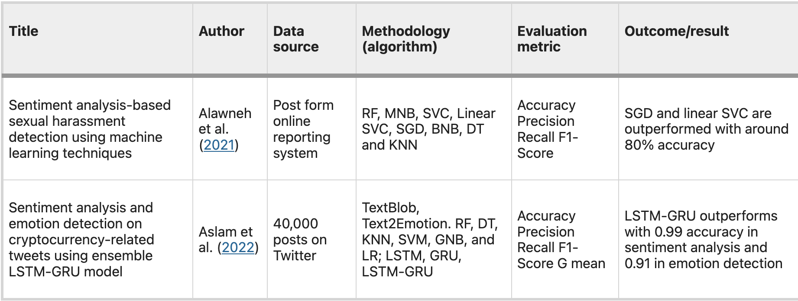
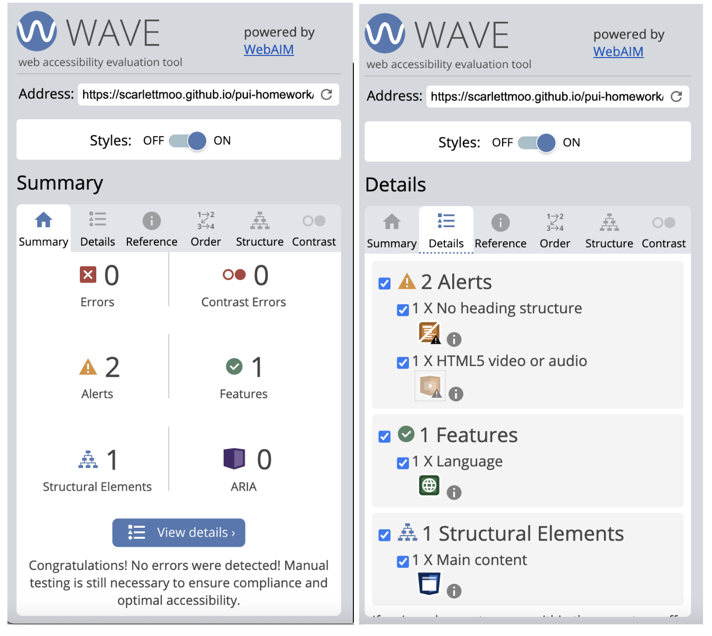
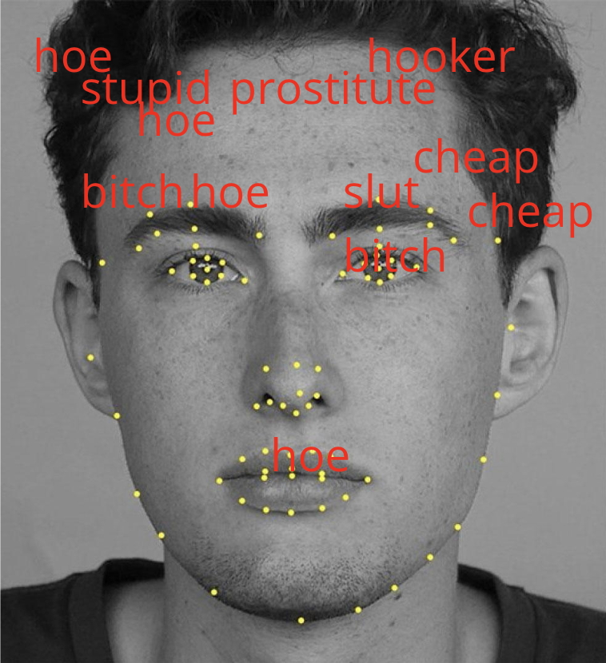
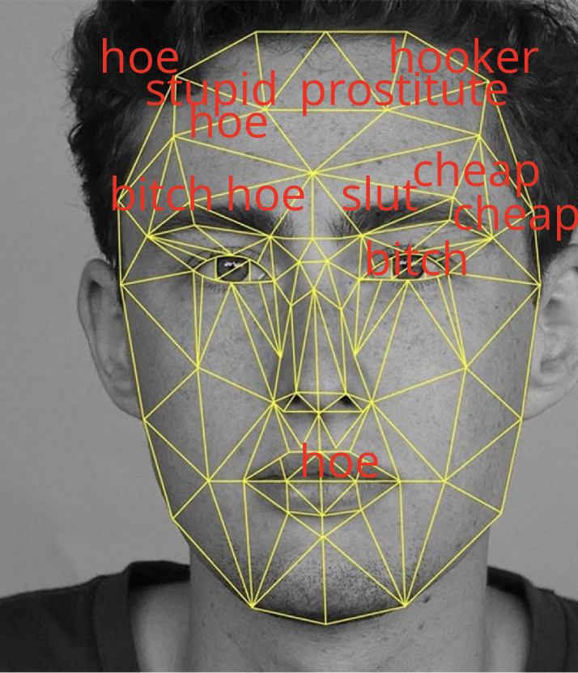
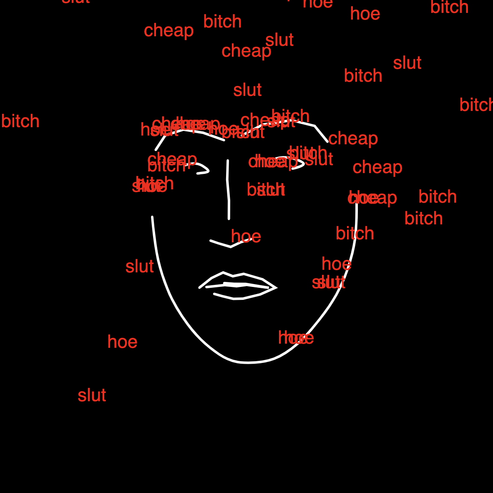
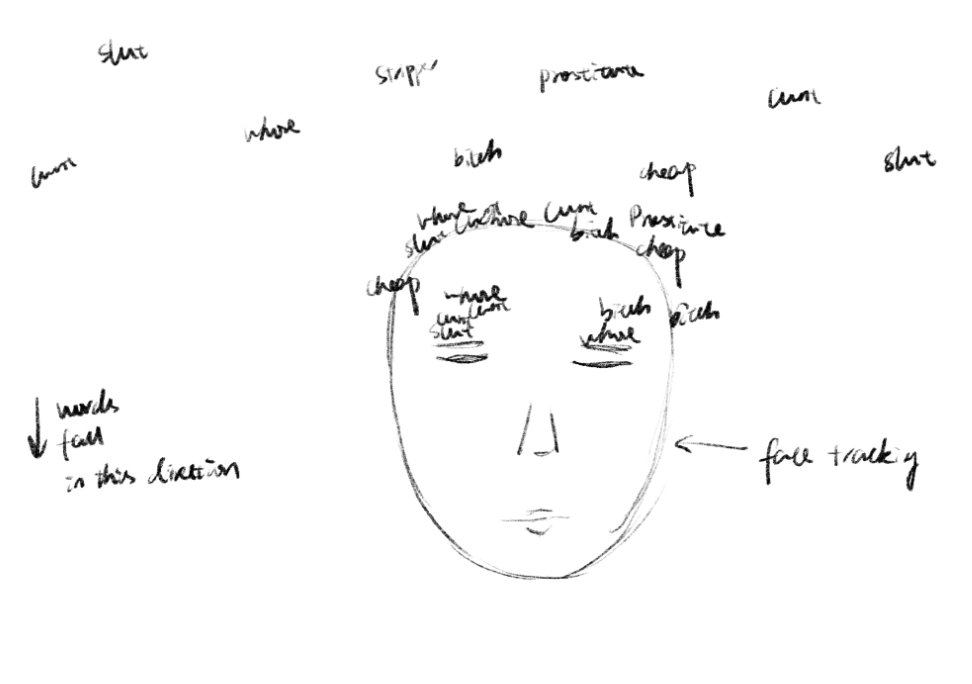
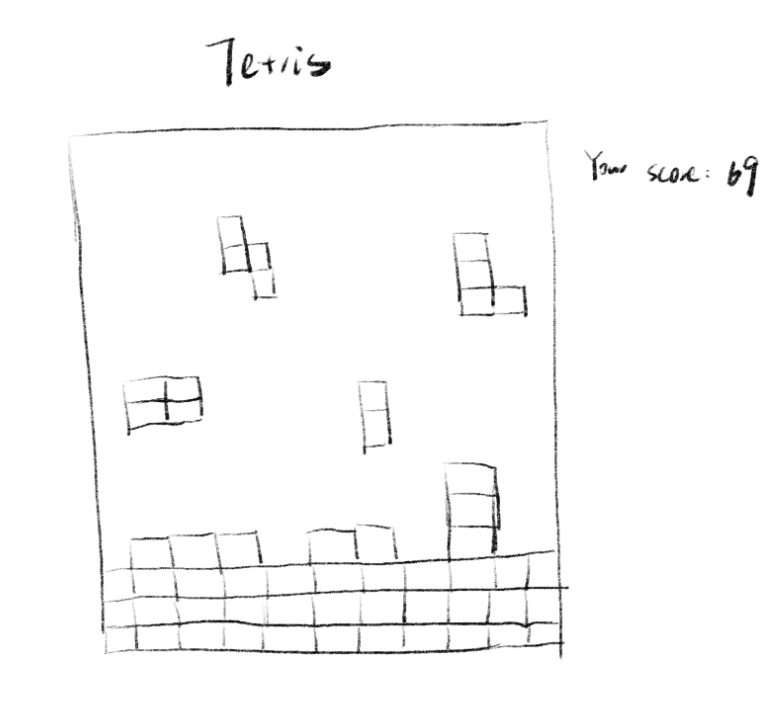
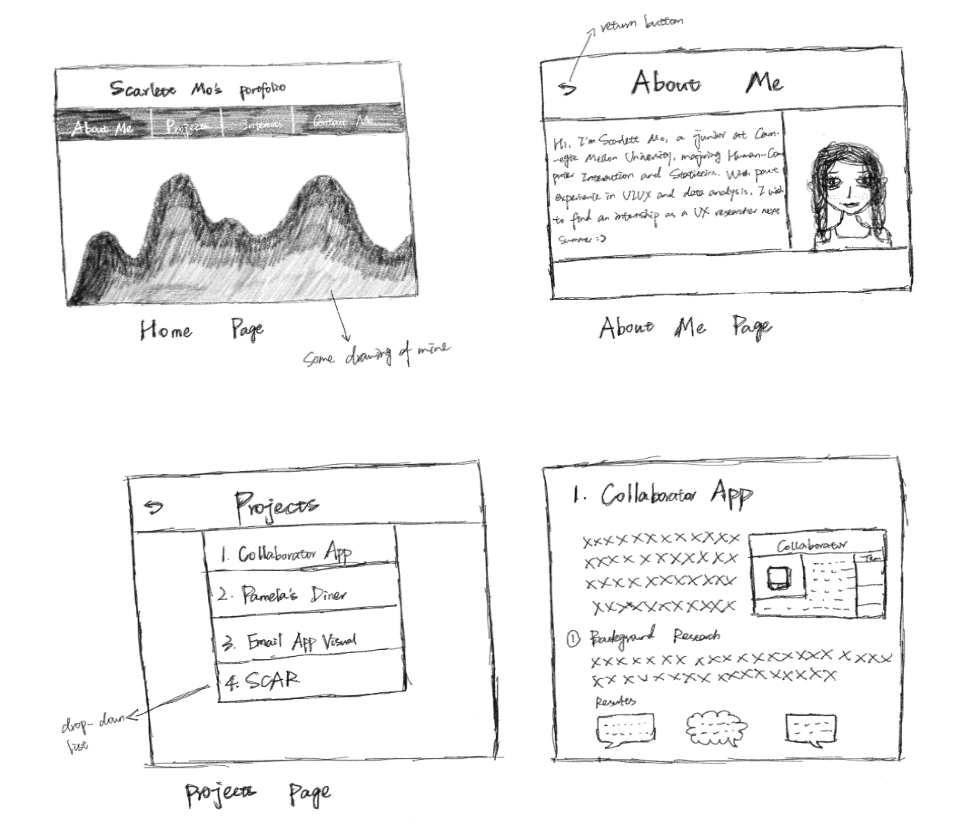

# **FP4 \- Final Project Writeup**

## Part 1: Website Description

PATHS is an interactive art installation that incorporates p5.js and a face-tracking algorithm OpenCV to create an immersive experience for the audience. In this project, the basic idea is to simulate a visual metaphor where words like "slut," "whore," and "cheap" cascade from the top of the screen and come to a halt when they touch the viewer's face, evoking a powerful sense of metaphorical humiliation and mimicking the experience faced by women in their everyday life. This design will be interactive and engaging by allowing viewers to actively participate in the experience, taking them on a journey from the initial cascade of derogatory words to a moment of reflection and dialogue as they interact with the installation.

Therefore, the purpose of PATHS is to challenge societal norms and confront the issue of slut-shaming in today’s society. I wish PATHS could encourage reflection and dialogue on the issues of slut-shaming, fostering engagement and prompting visitors to contribute to the ongoing conversation. The target audience of this project includes individuals interested in societal issues, gender equality advocates, and everyone seeking an immersive and thought-provoking interactive art experience. To convey the message of anti-slut shaming, minimalist visual style was adopted to enhance the impact, emphasizing the powerful message of PATHS. 

## Part 2: User Interaction
1. Move Around the Head to Test Face Tracking:
  The user’s facial movements will trigger face tracking. The user needs to grant camera access to the webpage (Chrome preferably) so that the face-tracking algorithm can detect their face. And once they see the green dot on the camera (indicating camera is working properly), they can move around their face to test the face-tracking feature. The algorithm detects and responds to these movements in real-time, enhancing the interactive experience. It might take some time for the algorithm to load on some users' computer. The user’s face will be outlined with white lines. 

2. Visual Engagement with Falling Words:
  Humiliating words will cascade from the top of the screen, halt when they touch the viewer's face, and pile up when they stop falling to the bottom of the screen. And when they move away their face, the words will keep falling. Participants can move their face around to see if the words will stop falling when they touch the face, which creates a powerful and immersive experience.

## Part 3: External Tool

1. p5.js  
   * Why: the choice of p5.js is driven by its simplicity and versatility in creating interactive visual graphics. It aligns seamlessly with the project's goal of providing an engaging and visually appealing experience.
   * How: I incorporated the OpenCV in p5.js and since the original face-tracking algorithm displays the user’s real face and background, I utilized p5.js to paint the background black and only keep the outline of the user’s face. In this way, it preserves a better artistic style than displaying the user’s real face and background directly.
   * What does it add to my website: The integration of p5.js shifts the practical use of the original algorithm to a more artistic use and it maintains the minimalistic visual style. Also, it adds a layer of interactivity to the project, allowing for the creation of visually compelling graphics.

2. OpenCV
   * Why: the selection of OpenCV as the face-tracking algorithm was driven by the need to incorporate accurate facial recognition into the interactive experience. OpenCV is a robust and widely used tool for computer vision tasks.
   * How: I used OpenCV’s algorithm to detect the participant’s face and I found the p5.js version of OpenCV but was not working smoothly. So I broke down the algorithm into parts and removed some detection points on the face so it would work more smoothly.
   * What does it add to my website: the use of OpenCV builds the foundation of the interactive aspect of this installation. It accurately tracks the viewer's face, allowing the falling words to respond in real time to the user's movements, enhancing the overall impact of the visual metaphor and contributing to the personalized nature of the experience.

## Part 4: Design Iteration

During the development of PATHS, user testing played a pivotal role in shaping the project's visual design. Two prototypes were created, each with distinct visual styles. Prototype 1, featuring a minimalist design, garnered positive feedback for effectively conveying the falling
words and engaging users. In contrast, users found Prototype 2's pixelated style confusing and less visually attractive. The feedback guided the decision to choose Prototype 1 as the final design.

Simultaneously, the integration of OpenCV into the p5.js environment presented challenges. To incorporate OpenCV into p5.js, I had to do extensive research and see how other developers were implementing it. The first version of the algorithm seemed to be slow and buggy on some users’ computers during my user testing session. Therefore, I had to break down the code and by experimenting with adding and removing some detection points on the face, I improved the algorithm in multiple iterations.

## Part 5: Implementation Challenge

Main challenges encountered were translating OpenCV to JavaScript and optimizing loading times for the face-tracking functionality. At first, it took a long time for face tracking to load and it stumbled a lot throughout the experience in my early user testings. Additionally, it took me a long time to determine the artistic visual design of the page since the original OpenCV code directly shows the real-time face and background. Thus, I had to design two prototypes and I was glad the minimalist one had good feedback and had a great way of conveying the
message.

## Part 6: Generative AI Use and Reflection

### Usage Experiences by Project Aspects

| Tool Name | Ratings | design | plan | write code | debug | research |
| :---- | :---- | :---- | :---- | :---- | :---- | :---- |
| NLP-based Generative AI Tools | Usage | No | No | No | No | Yes |
| NLP-based Generative AI Tools | Productivity | N/A | N/A | N/A | N/A | 5 |
| Midjourney or Other Visual Style Generators| Usage | Yes | No | No | No | Yes |
| Midjourney or Other Visual Style Generators | Productivity | 6 | N/A | N/A | N/A | 5 |

### Usage Reflection

> Impact on your design and plan 
* It matched my expectations and plan in [FP2](#generative-ai-use-plan) in that generative AI will help me leverage during the design and research stage. For example, 
  1. AI-driven Natural Language Processing (NLP) tools: they helped me analyze language around online sexual harassment related to slut shaming, specifically focusing on gendered slurs and derogatory terms associated with slut-shaming. This offers me insights about the choices of the falling words. 
  2. Generative AI image creation tools: they helped me visualize different visual styles of the face tracking algorithm. The mockups allow me to set my mind on a minimalist style and fine-tune the visual elements before full implementation, ensuring the aesthetics align with the project’s minimalist, impactful tone. 
* GenAI tool did not influence my final design and implementation plan because they were only used mainly for brainstorm purposes. For example, 
  1. AI-driven Natural Language Processing (NLP) tools: they did not help with the design and algorithmic decisions of the project. It was only used to research about what falling words I should include to reflect the situations of slut shaming in reality.
  2. Generative AI image creation tools: althogh I used these tools to visualize several designs, given the specific visual of the face tracking algorithm, specific design decisions need to be tailored to fit the algorithm. Therefore, the tools were only used for brainstorming purposes.

> Use patterns
* I accepted the generations when they corrected my own bias of the matter. For example, 
  1. AI-driven Natural Language Processing (NLP) tools: this tool once suggested instead of words like "slut" and "bitch" that were obvious slut shaming, more forms of slut shaming take on subtle forms like "cheap" on social media. And I adjusted my design according to the suggestion because I did not think of that aspect of slut shaming and the tools helped me identified my own bias of that matter.
* I evaluated the generated suggestions by drawing inspirations from the tools but determining the final visual style by tailoring to the face-tracking algorithm. For example, 
  1. Generative AI image creation tools: the mockups generated by these tools helped me visualize possible interfaces. Drawing inspirations from the mockups and tailoring my own design based on the algorithm, I developed two visuals during the user-testing stage.

> Pros and cons of using GenAI tools
* Pros
  1. AI-driven Natural Language Processing (NLP): helped identfy my own bias about slut-shaming so I can include more subtle words related to slut-shaming, making my project more representative of the matter. 
  2. Generative AI image creation tools: helped me brainstorm possible visuals, inspiring me to design different visuals for user testing.
* Cons
  1. AI-driven Natural Language Processing (NLP): only analyzed words related to slut-shaming online, especially social media, which could cause potential bias.
  2. Generative AI image creation tools: most mockups were not feasible to implement with the specific face-tracking algorithm used.

### Usage Log

Document the usage logs (prompts and chat history links) for the GenAI tools you used. Some tools may not have an easy way to share usage logs, just try your best! Some instructions for different tools:
1. [Generative AI image creation tools]: https://chatgpt.com/share/6753286d-7ed8-800e-8463-fd817184fcbd
2. [AI-driven Natural Language Processing (NLP)]:

## Appendix

The website is tested on iPads, Laptop, and iPhones.

---

# **FP3 \- Final Project Check-in**

Document the changes and progress of your project. How have you followed or changed your implementation & GenAI use plan and why? Remember to commit your code to save your progress.

## Implementation Plan Updates

- [ ] The interface only takes up the middle part of the laptop screen. Try to make it furfill the whole screen.
- [ ] Make sure the size of the canvas adapts to both laptop and mobile devices.

---

# **FP2 \- Evaluation of the Final project**

## Project Description

My final project is an interactive art installation that uses p5.js and a face-tracking algorithm to challenge societal norms around slut-shaming. In this experience, words like "slut" cascade from the top of the screen, only to come to a halt when they touch the viewer's face, viewers are prompted to confront the damaging impact of derogatory language on women's self-expression and autonomy. The design will be interactive and engaging by allowing users to physically move their faces through the camera on their laptop, directly interacting with the falling words. The message I want to convey through this art installation is to challenge societal norms and confront the issue of slut-shaming. 

## High-Fi Prototypes

### *Prototype 1*

This prototype uses the OpenCV's original algorithm in Python which displays the real time image of the face and outlines key facial features with dots. Insulting words like will fall from the top of the screen, only to come to a halt when they detect key facial features.

### *Prototype 2*

This prototype also uses the OpenCV's original algorithm in Python which displays the real time image of the face but unlike prototype 1, this prototype outlines key facial features with lines. Insulting words like will fall from the top of the screen, only to come to a halt when they detect key facial features.

## Usability Test

During the usability testing for my project, I conducted an A/B test to evaluate user preferences and gather feedback on two design versions. Participants were randomly shown either Prototype 1 or Prototype 2 and asked to perform specific tasks while interacting with the interface. Their responses were recorded to measure their interactions, preferences, and any challenges they encountered with each design.

The feedback from Prototype 2 is more positive, which used an overlay of lines to connect facial landmarks, as it provided a clear, structured representation of facial tracking. However, participants suggested that the current design contained too many lines, leading to visual clutter. They recommended reducing unnecessary lines to create a cleaner, more streamlined aesthetic, aligning with minimalist design principles. This feedback inspired me to refine the design by only keeping lines for key facial features like eyes and mouth and removing lines that didn’t contribute to the algorithm's functional clarity, thereby achieving a more minimalist look without compromising the effectiveness of the tracking display.

Additionally, users highlighted a critical issue where the overlayed face-tracking grid occasionally overlapped with the real time image of the face, making it difficult to read the falling words clearly. This feedback pointed to the need for adjustments in how the overlay interacted with the face to enhance readability. In response, I removed the real time image of the face and chose black to the background color to ensure that users could discern both the face and the tracking elements without interference.

This usability test provided valuable insights that directly influenced the final design. By simplifying the original OpenCV algorithm and addressing the readability issue, the final iteration balanced functionality with a clean, minimalist aesthetic that users found visually pleasing and easy to interpret.

## Updated Designs

Based on user feedback, I made several adjustments to improve clarity and aesthetics in the design. First, I removed the real-time image of the face to ensure the audience could read the falling words without visual interference, allowing the focus to be solely on the text. I simplified the face-tracking algorithm by removing unnecessary lines, outlining only key features like eyes, nose, mouth and the outline of the face to create a cleaner, minimalist look. Additionally, I enhanced the contrast by using red for the words against a black background, with a white outline around the face. This contrast reinforces a minimalist aesthetic, making the design more visually impactful and easier to interpret.

## Feedback Summary

The feedback from my lab was overall positive. People liked the concept and theme of my project, especially the theme on slut-shaming and highlighted the importance of conveying such a message in an impactful way. They felt that addressing online harassment and gendered slurs through this interactive medium could provoke thoughtful reflection among viewers. They also thought the OpenCV algorithm has a cool interface and were excited to see different visuals on top of that.

However, several key suggestions were offered to enhance the design and user experience. First, they suggested trying to transform the falling words into raindrop-like elements with physics-based motion. This change would add a more dynamic and engaging visual effect, making the interface feel immersive and aesthetically captivating. This raindrop effect was seen as a way to elevate the visual appeal, adding a layer of sophistication to the overall presentation. Another suggestion focused on enhancing the impact of the words used. People suggested me to do more research on databases of words commonly associated with slut-shaming on social media platforms. Like a heat map, frequently used words could be displayed in darker shades, while less common ones could appear in lighter shades. This would draw the viewer’s attention to the intensity of specific words, creating a visually powerful representation of harmful language and adding depth to the project’s message. Additionally, the feedback suggested adding a user input feature, allowing viewers to contribute their own words into the system. This would make the experience more interactive and personalized, inviting users to actively engage with the topic. Finally, the lab recommended including an intro or outro component, similar to an artist statement. This would provide context and frame the experience, ensuring viewers understand the purpose of the project before and after interacting with the visuals.

## Milestones

### *Implementation Plan*

To ensure steady progress and complete the project by the end of the semester, I’ve outlined weekly milestones to guide the implementation. Each week will focus on a specific aspect of development, from core functionality to refinement and testing.

- [ ] Week 10 Nov 4 \- Nov 8: Research on Face-tracking in p5.js 
  - [ ] FP2 due
  - [ ] Based on my research from last week, since the original algorithm was in Python, it's easier to incorporate that into p5.js instead of JavaScript. I will start researching about specific methods and codes to realize the face tracking algorithm in p5.js.

- [ ] Week 11 Nov 11 \- Nov 15: Modify Face-tracking Algorithm
  - [ ] This week will involve breaking into the algorithm and removing lines of the face for a minimalist effect as A/B testing results suggested. And I will start coding the interface and get the majority of the coding done.

- [ ] Week 12 Nov 18 \- Nov 22: Experiment with Different Effects 
  - [ ] I will try incorporating the rain drop effect suggested in the lab today. And I will do research on slut shaming word databased to provide more variety to the words. I will also try different colors and shades for the background, face, and words to see which visual is the most ideal.

- [ ] Week 13 Nov 25 \- Nov 29: Finish Coding
  - [ ] Thanksgiving  
  - [ ] Since it's Thanksgiving so I won't have much time, I will just finish coding and do some final touches.
- [ ] Week 14 Dec 2 \- Dec 6: Final User Testing
  - [ ] FP4 due 
  - [ ] This week, I’ll present my final project to users for testing to gather feedback so I can make some last changes.

### *Libraries and Other Components*

I plan to use OpenCV and p5.js. I will use OpenCV to detect the viewer's face to realize the face-tracking feature. I will use p5.js since OpenCV displays the user's real face and background so I will paint the background black and only keep the outline of the face using p5.js so it presents a better minimalist aesthetics.

## Generative AI Use Plan

To streamline the development and enhance the effectiveness of my face-tracking project, I plan to leverage Generative AI tools at various stages of implementation, from research and visual design to content refinement. These tools will allow me to focus on creating a seamless and impactful experience for users while also improving efficiency.

Generative AI is the most important when it comes to research. I’ll use AI-driven Natural Language Processing (NLP) tools to analyze language around online sexual harassment related to slut shaming, specifically focusing on gendered slurs and derogatory terms associated with slut-shaming. This will enable me to build a robust understanding of terms relevant to the project’s theme. By quickly categorizing and analyzing frequently used words, I’ll have a solid foundation for creating a list of meaningful words used in this project. 

Generative AI image creation tools can also assist in the visual prototyping stage. I can experiment with various styles and effects, such as transforming words into raindrop-like elements with physics-based motion. These mockups will allow me to visualize different concepts and fine-tune the visual elements before full implementation, ensuring the aesthetics align with the project’s minimalist, impactful tone.

To further refine the user experience, Generative AI tools can support the design of an intuitive interface for user interaction. By experimenting with AI-driven suggestions, I’ll develop a clean, minimalist interface that seamlessly integrates with the face-tracking algorithm. This interface will also include user input capabilities, allowing viewers to add their own terms, which will dynamically integrate into the visuals.

### *Tool Use*

* NLP-based Generative AI Tools
  * I will use it for analyzing and categorizing language related to slut-shaming and online harassment, which will provide a basis for selecting the most impactful words. 
  * I will not use it for auto-generate words because it will not help me understand the topic in depth.

* Midjourney or Other Visual Style Generators
  * I will use it to explore visual styles and textures that fit with the project’s theme, experimenting with minimalist or impactful aesthetic ideas. This exploration can help me narrow down the visual direction for the project and identify unique styles that make the design more engaging.
  * I will not use it for finalizing the design, as I want to retain control over the project’s final aesthetic. Generative tools may offer inspiration, but the final implementation will be tailored manually to ensure consistency with the project’s message and theme.

### *Responsible Use*

Using generative AI responsibly in my project involves ensuring that the tools enhance the quality and integrity of the final outcome without compromising ethical standards. First, I will not use generative AI to generate code automatically since I think practicing and debugging are essential to my learning. Second, I would critically assess AI-generated content, particularly when analyzing language related to sensitive topics like slut-shaming and harassment. This means reviewing and filtering the AI-suggested words to avoid unintentionally amplifying or misrepresenting harmful language. Additionally, when generating visuals or design ideas, I would avoid over-relying on AI outputs, ensuring that they serve as inspiration rather than the final product. By refining and customizing the AI-generated content, I retain creative control and ensure the design aligns with the project’s purpose and message. Transparency is also essential, so I would acknowledge the role of AI in the research, prototyping, and conceptual stages of the project, clarifying that human oversight guided the final decisions.

---

# **FP1 \- Proposal for Critique**

## Idea Sketches

### *Idea 1 Interactive Art Installation*

The basic idea of my final project is to create an interactive installation that uses p5.js and a face-tracking algorithm to challenge societal norms around slut-shaming. In this experience, words like "slut" cascade from the top of the screen, only to come to a halt when they touch the viewer's face, viewers are prompted to confront the damaging impact of derogatory language on women's self-expression and autonomy. The design will be interactive and engaging by allowing users to physically move their faces, directly interacting with the falling words. To ensure accessibility, I will use clear and semantic HTML tags, making the installation easier to navigate with screen readers. The message I want to convey through this art installation is to challenge societal norms and confront the issue of slut-shaming. 

### *Idea 2 Interactive Game Tetrics*

The basic idea of my second project is to create an interactive rendition of the classic game Tetris, titled "Tetrics," offering a digital environment where users can engage with this iconic puzzle game. Players will interact with falling blocks, arranging them to complete lines and challenge their problem-solving skills. The design will be interactive by allowing players to control the blocks using keyboard input or touch controls, making the gameplay intuitive and responsive. To ensure accessibility, I will use clear and semantic HTML tags, allowing for compatibility with screen readers and assistive technologies. The core message of this project is to provide an enjoyable and accessible gaming experience that fosters entertainment and mental challenge.

### *Idea 3 Personal Portfolio*

The basic idea of my third project is to create a personal portfolio that showcases my self-introduction, HCI projects, internship experiences, and artistic work, including drawing and photography. The portfolio will be interactive by providing easy navigation through different sections, allowing visitors to explore each area of my work seamlessly. To ensure accessibility, I will use clear and semantic HTML tags, making the website navigable with screen readers and accessible to all users. The goal of this portfolio is to present a well-rounded view of my professional and creative journey, highlighting both my technical skills in UIUX and artistic expression.

## Feedback Summary

From the feedback session, I learned that people really liked my first idea, the interactive art installation under the theme of slut shaming, since it is fun to interact with but also has its educational purpose. My second idea of Tetris is also loved since it is a upgrade of the traditional game but it would be challenging to create something new on top of a classic game. And if I aim to build a 3D Tetris, it might be hard to realize the 3D visuals in JavaScript. And especially if I want to keep the rotation feature in a 3D Tetris, I will probably have to code each block individually and figure out the rotation figure in JavaScript, which will take up a lot of work. Also, I decide not to continue with my third idea, which is the personal portfolio, since a lot of people are doing portfolio for their final project so the TA suggets us to try something different and fun. 

The main concern that was brought up during the feedback session was the ability to implement the face-tracking algorithm in JavaScript since I can only find similar algorithm in Python. Hoepefully I can find a similar algorithm in p5.js, which will be the easiet way I can imagine to implement in JavaScript. Also, people gave me valuable advice on the visuals of the interface. For example, when the words were 'raining' from the top of the screen to the bottom, I need to make sure they do not interfere with the background so it is easy for the audience to read. Additionally, I can include more subtle slut shaming words instead of only including intrusive words like "cunt". And I can also add an audio component to the interface when the words land on the viewer's face to build a more wholistic experience for the viewer. 

## Feedback Digestion

Thus, taking all the feedback above, I decide to move froward with my first idea for the final project, which is the interactive art installation under the theme of slut shaming. The feedback session highlighted several key areas to refine and improve my idea. The primary technical challenge identified was implementing the face-tracking algorithm in JavaScript. After the critique session, I did some research on the face-tracking algorithm and I found several robust face-tracking algorithms in Python but JavaScript offers fewer options, which limits my flexibility. However, I did find some face-tracking algorithm in p5.js which should work for my project. However, it only provides basic tracking of the face so maybe I need to customize the existing algorithm like adding more detection points on the face to make the algorithm work more precisely to achieve the desired effect.

Beyond the technical requirements, the feedback also prompted me to think about the project’s visual presentation, especially the display of the background and the words cascading from the top of the screen. To ensure that the audience can read the words properly, I plan to experiment with the background and text contrast. One approach could be using a single color for the background like black and a different color for the words like red to highlight the words. Another approach can be using a blurred or semi-transparent background to prevent the words from blending in, or adding a subtle shadow or glow effect around each word to make it stand out. These tweaks can enhance readability while preserving the visual cohesion of the installation. I will experiment with different approaches but I think for artistic purposes, I would like to maintain a minimalistic, monochromatic palette that aligns with the serious tone of the subject but also ensures clarity and focus on the interactive elements.

Taking in all the feedback from today, the next step for me will be to do more research on the face-tracking algorithm to figure out how to incorporate it into JavaScript and experiment with different visuals. The session has provided actionable insights to push both the technical and thematic aspects of the installation forward, and I’m looking forward to exploring these solutions as I continue to develop the project.

---
